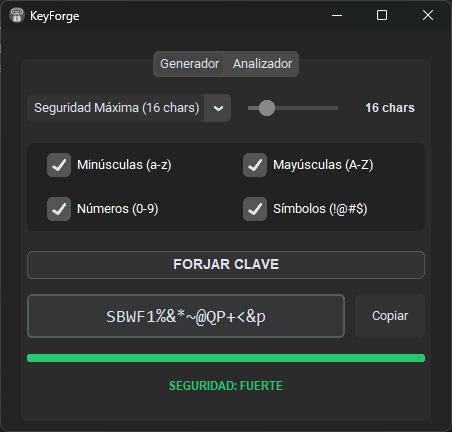
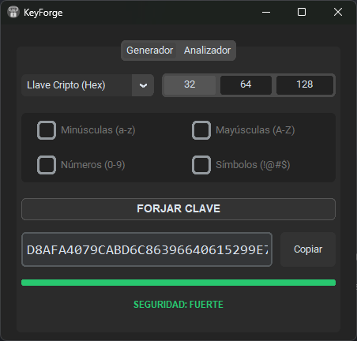
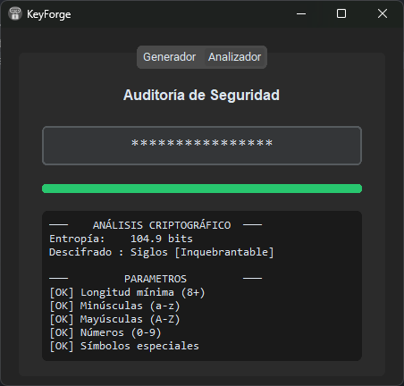

# 🛡️ KeyForge

**KeyForge** es una herramienta de escritorio de grado profesional diseñada para la generación y auditoría criptográfica de contraseñas. Construida con Python y una interfaz gráfica moderna, permite forjar credenciales altamente seguras y analizar la entropía matemática de contraseñas existentes en tiempo real.



---

## ✨ Características Principales

### ⚒️ Generador Inteligente
* **Algoritmos Criptográficos:** Utiliza `secrets` (no `random`) para la generación de números pseudoaleatorios seguros (CSPRNG).
* **Presets de Industria:** Generación rápida de PINs, Códigos Temporales, Estándares Web y Seguridad Máxima (16+ caracteres).
* **Llaves Criptográficas (Hex):** Generación de llaves hexadecimales estándar (128, 256 y 512 bits) ideales para cifrado AES.
* **Frases de Seguridad (BIP-39):** Integración directa con el estándar mundial de Bitcoin para generar *Passphrases* de alta entropía, fáciles de memorizar y matemáticamente balanceadas.

### 🔍 Analizador de Entropía
* **Cálculo de Entropía Real:** Implementa la fórmula de la Teoría de la Información de Shannon ($E = L \cdot \log_2(R)$) para evaluar la fuerza bruta matemática.
* **Tiempo Estimado de Hackeo:** Calcula el tiempo necesario para vulnerar la clave asumiendo un hardware capaz de procesar 10 mil millones de hashes por segundo.
* **Auditoría de Vulnerabilidades:** Compara la entrada contra bases de datos en tiempo real (SecLists) para detectar si la contraseña ha sido filtrada previamente.

---

## 📸 Interfaz de Usuario (UI/UX)

La aplicación fue diseñada siguiendo principios de diseño defensivo y estandarización corporativa:
* **Escala de Grises:** Paleta de colores minimalista y enfocada, donde el color solo se utiliza para reportar el estado de seguridad (Rojo: Vulnerable, Amarillo: Media, Verde: Fuerte).
* **Prevención de Errores:** Atenuación automática (Grayscale) y bloqueo de controles irrelevantes según el contexto del usuario (State Management).
* **Diseño sin Saltos:** Contenedores estáticos que evitan el *Layout Shift* al cambiar entre componentes dinámicos.

| Generador Hexadecimal | Analizador de Entropía |
| :---: | :---: |
|  |  |
| *Controles restringidos a estándares criptográficos fijos.* | *Reporte estilo terminal con estimación de tiempo.* |

---

## 🚀 Instalación y Uso

### Opción 1: Ejecutable Standalone (Windows)
Descarga la última versión desde la sección de **Releases** de este repositorio. No requiere instalación de Python. Simplemente haz doble clic en `KeyForge.exe`.

### Opción 2: Ejecutar desde el código fuente
Asegúrate de tener Python 3.8 o superior instalado.

1. Clona este repositorio:
   ```bash
   git clone [https://github.com/FernandoPZ/SecureKey-Gen.git](https://github.com/tu_usuario/SecureKey-Gen.git)
   ```
2. Instala las dependencias necesarias:
   ```bash
   pip install -r requirements.txt
   ```
3. Ejecuta la aplicación:
   ```bash
   python main.py
   ```

---

## 🛠️ Tecnologías Utilizadas
* **Lenguaje:** Python 3.13
* **Interfaz Gráfica:** CustomTkinter, Tkinter
* **Criptografía y Matemáticas:** `secrets`, `math`
* **Peticiones HTTP:** `requests` (Sincronización de diccionarios en segundo plano)
* **Compilación:** PyInstaller

---

## 🔒 Seguridad y Privacidad
KeyForge Suite funciona principalmente de manera local (Offline-first). La conexión a internet solo se utiliza durante el inicio (Splash Screen) para descargar y actualizar en memoria RAM el estándar BIP-39 y las listas de contraseñas vulnerables. **Ninguna contraseña generada o analizada abandona tu dispositivo ni se guarda en ninguna parte.**

---
*Desarrollado con pasión por la ciberseguridad.*